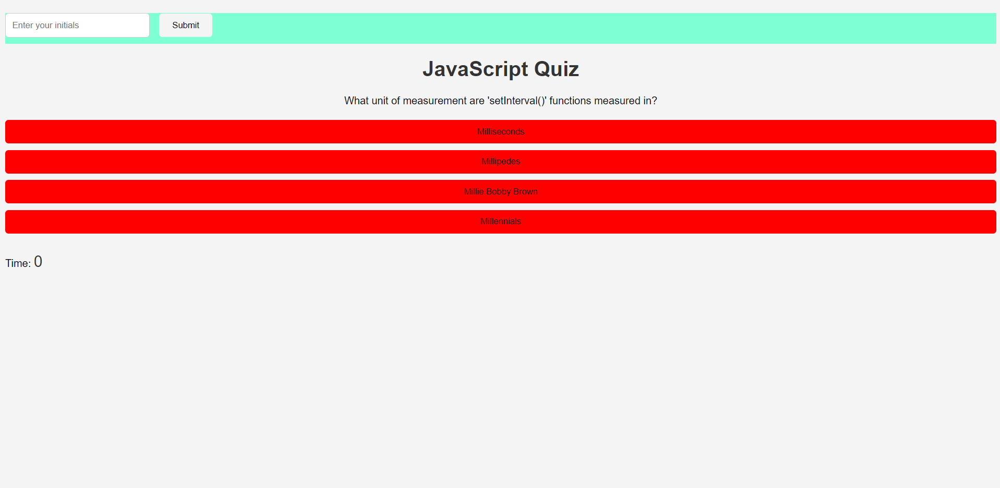

# JavaScriptQuiz

## Description
A short quiz to really test your knowledge on JavaScript related information. Using JavaScript the website presents you with a series of questions one at a time (so the user does not get overwhelmed) and  multiple choice options to choose from. The users score is then calculated according to the users performance and ranked against previous test-takers.

## How to Use
To participate, simply navigate to the website [here](https://mavarreteno.github.io/JavaScriptQuiz/), and you'll be presented with the title and a start button. If you can't find it, look for a red square labeled 'Press Here to Start Quiz'. Once you press the start button, the quiz will begin and you'll be presented with the first question and the timer will begin. Press the correct answer and you'll safely move on to the next question, but answer wrong and you will be penalized fifteen seconds on the clock. If you run out of time, then the quiz will end and you'll be presented with an alert to let you know that your time is up and the "game" is over. If you so happen to finish the quiz with time to spare, then you'll be able to add your initials to your score in the green section. Once you submit, you'll see how your performance stacks up to all the others'. 
